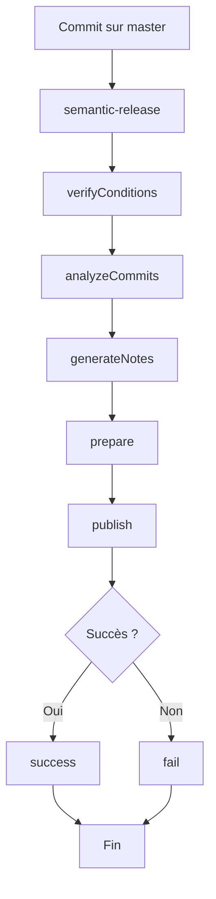
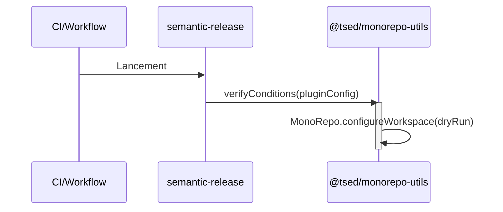
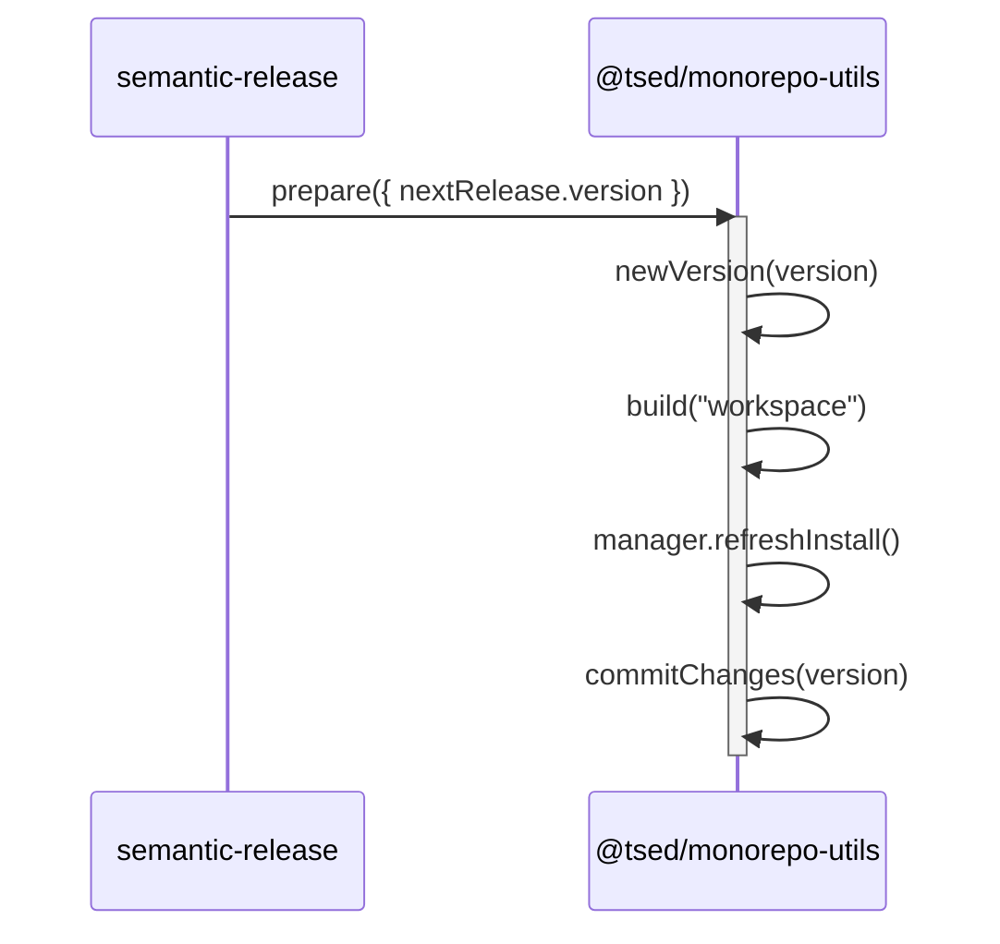
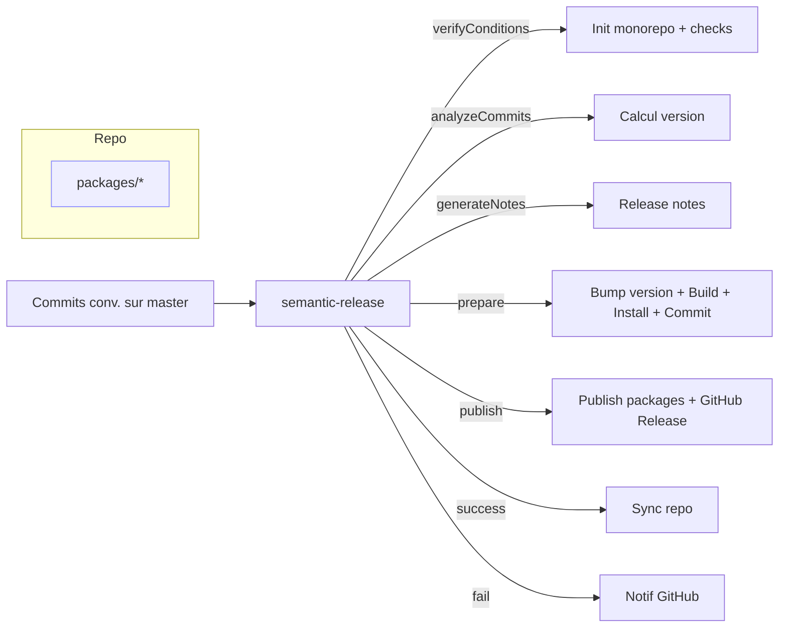

# Guide de la release (semantic-release)

Ce document explique comment le processus de release est orchestré dans ce dépôt à l’aide de semantic-release, en s’appuyant sur la configuration `release.config.js` et sur le plugin interne `@tsed/monorepo-utils/semantic-release` fourni par ce repo (package: `packages/monorepo`).

- Fichier de configuration: `release.config.js`
- Branche de release: `master`
- Publication npm directe: désactivée (`npmPublish: false`)
- Outils clés: `semantic-release` + plugins officiels (GitHub, NPM, commit-analyzer, release-notes-generator) + plugin interne `@tsed/monorepo-utils/semantic-release`


## Vue d’ensemble du flux

semantic-release enchaîne des étapes standardisées. Voici la vue d’ensemble telle que paramétrée dans `release.config.js`:



Correspondance avec les plugins:
- verifyConditions: `@semantic-release/github`, `@semantic-release/npm`, `@tsed/monorepo-utils/semantic-release`
- analyzeCommits: `@semantic-release/commit-analyzer`
- generateNotes: `@semantic-release/release-notes-generator`
- prepare: `@semantic-release/npm`, `@tsed/monorepo-utils/semantic-release`
- publish: `@tsed/monorepo-utils/semantic-release`, `@semantic-release/github`
- success: `@semantic-release/github`, `@tsed/monorepo-utils/semantic-release`
- fail: `@semantic-release/github`

Note: `npmPublish: false` signifie que la publication sur le registre npm n’est pas effectuée par `@semantic-release/npm`. La publication des packages est déléguée au plugin interne du monorepo (voir ci-dessous).


## Détail par étape

### 1) verifyConditions
Plugins: `@semantic-release/github`, `@semantic-release/npm`, `@tsed/monorepo-utils/semantic-release`

- Vérifie que l’environnement est correctement configuré (auth GitHub, NPM, etc.).
- Plugin interne: initialise le contexte monorepo.
  - Code source: `packages/monorepo/semantic-release.js`
  - Extrait pertinent:
    - Crée une instance `MonoRepo` pointant sur le `cwd`.
    - Appelle `monoRepo.configureWorkspace({dryRun})` pour préparer l’espace de travail.



### 2) analyzeCommits
Plugin: `@semantic-release/commit-analyzer`

- Analyse les messages de commit (conventionnel) pour déterminer le prochain niveau de version (patch, minor, major).

### 3) generateNotes
Plugin: `@semantic-release/release-notes-generator`

- Génère les release notes en se basant sur les commits analysés.

### 4) prepare
Plugins: `@semantic-release/npm`, `@tsed/monorepo-utils/semantic-release`

- `@semantic-release/npm`: met à jour `package.json` (version), prépare d’éventuels artefacts;
- Plugin interne (comment le bump de version est propagé):
  1. Récupère `nextRelease.version` depuis le contexte semantic-release.
  2. Appelle `monoRepo.newVersion({version})` qui délègue à l’outil de workspace détecté (Yarn Berry, pnpm, npm, Lerna…).
     - Yarn Berry: `YarnBerry.newVersion()` appelle `bumpPackagesVersion(version, context)`.
       - `bumpPackagesVersion`:
         - Parcourt `package.json` du root + tous les workspaces.
         - Écrit `version = <version>` dans chacun.
         - Met à jour les dépendances internes (entre packages du monorepo) pour `dependencies`, `devDependencies`, `peerDependencies`:
           - Si la dépendance pointe vers un package interne et ne commence PAS par `workspace:`:
             - `dependencies`/`devDependencies` → remplace par la version exacte `<version>`.
             - `peerDependencies` → remplace par `>=<MAJOR>.0.0`.
           - Si la dépendance utilise `workspace:*`, elle reste intacte à ce stade; elle sera résolue plus tard lors de l’écriture des packages (voir ci-dessous).
     - Lerna: si présent, une commande `lerna version` est invoquée (sans tag git) puis l’outil du workspace met aussi à jour les versions.
  3. Construit les packages: `monoRepo.build("workspace")` (exécute les scripts de build des workspaces si configurés).
  4. Rafraîchit les installations: `monoRepo.manager.refreshInstall()` (ex. `yarn install --refresh-lockfile`).
  5. Commit des changements: `monoRepo.commitChanges({version})` (ajoute les `package.json`, lockfile, artefacts de build, etc.).

Détails sur la résolution `workspace:*` lors de l’empaquetage:
- La phase de build utilise `writePackages()` pour générer les `package.json` finaux à publier dans `distPath`.
- `writePackages` remplace toutes les versions `workspace:*` dans `dependencies` et `devDependencies` par la version du root (`rootPkg.version`, c.-à-d. la version calculée par semantic-release).
- `writePackages` ajuste aussi:
  - `main`: si `main` contient `/src/index.ts`, il devient `./lib/index.js` (et `typings` → `lib/index.d.ts`).
  - `publishConfig.tag`: défini selon le contexte:
    - si `branchName` ∈ {alpha, beta, rc} → tag npm correspondant (pré-release);
    - sinon on peut laisser le tag configuré dans le contexte (`npmDistTag`) ou le défaut du registre.



### 5) publish
Plugins: `@tsed/monorepo-utils/semantic-release`, `@semantic-release/github`

- Plugin interne: `monoRepo.publish("packages", {dryRun})`
  - Orchestration de la publication npm multi-packages selon le gestionnaire détecté (Yarn/NPM/Pnpm) et le mapping généré par `writePackages`.
  - Respecte `dryRun` (affiche ce qui serait publié sans pousser).
  - Utilise le `publishConfig.tag` calculé (par exemple `beta` sur la branche `beta`).
  
  Sous-étapes côté plugin interne (vue détaillée):
  1. Découverte des packages à publier (packages/*) et lecture de leurs manifestes issus de la phase de build.
  2. Préparation des manifestes de publication via `writePackages()` (déjà effectuée en prepare), incluant:
     - Remplacement des versions `workspace:*` par `rootPkg.version` dans `dependencies` et `devDependencies`.
     - Application du `publishConfig.tag` (dist-tag npm), déterminé par `branchName` ou `npmDistTag`.
     - Normalisation de `main`/`typings` si nécessaire (ex: `src/index.ts` -> `lib/index.js`).
  3. Sélection du registre/npm config: lecture de `.npmrc`/env et utilisation de `NPM_TOKEN` si disponible.
  4. Boucle de publication:
     - Pour chaque package non marqué `private: true`, exécuter `npm publish` (ou équivalent via le gestionnaire détecté) dans son dossier de distribution avec `--tag <dist-tag>`.
     - Respect du `dryRun`: en mode dry-run, la commande est simulée et les actions sont loguées sans pousser sur le registre.
     - Gestion d’ordre de publication cohérente (packages de base d’abord si nécessaire) et reprise simple en cas d’échec ponctuel (selon le gestionnaire).
  5. Journalisation: pour chaque package, le nom, la version, le tag appliqué et le registre cible sont affichés.

  Diagramme des sous-étapes de publish:
  ```mermaid
  flowchart TD
    A[Entrée publish] --> B[Découvrir packages]
    B --> C[Appliquer mapping writePackages]
    C --> D[Sélection dist-tag]
    D --> E[Configurer auth npm - NPM_TOKEN]
    E --> F{dryRun ?}
    F -- Oui --> G[Simuler npm publish et logger]
    F -- Non --> H[Exécuter npm publish --tag <tag>]
    H --> I[Logger résultat]
    G --> I
  ```

- `@semantic-release/github`: crée la release GitHub (tag, assets, notes).

Sorties attendues (deliverables):
- Sur npm (ou le registre configuré):
  - Une ou plusieurs publications effectives des packages du monorepo: `<package-name>@<version>`.
  - Chaque publication est associée au dist-tag calculé (`latest`, `alpha`, `beta`, `rc`, …).
- Sur GitHub:
  - Création d’un tag git `v<version>` et d’une « GitHub Release » contenant les release notes.
  - Éventuels assets ajoutés si configurés dans semantic-release (non configuré par défaut dans ce repo).
- Journaux CI:
  - Liste des packages publiés (ou simulés en dry-run), avec version et tag.

### 6) success
Plugins: `@semantic-release/github`, `@tsed/monorepo-utils/semantic-release`

- `@semantic-release/github`: finalise les informations de release côté GitHub.
- Plugin interne: `monoRepo.sync("repository")` (si pas en `dryRun`)
  - Synchronise l’état du repository (push des changements, tags ou métadonnées nécessaires au monorepo).

### 7) fail
Plugin: `@semantic-release/github`

- Notifie l’échec de release sur GitHub (statut, commentaires, etc.).


## Le plugin interne `@tsed/monorepo-utils/semantic-release`

Ce plugin est implémenté dans ce dépôt et exposé par le package principal situé dans `packages/monorepo`. Le point d’entrée du plugin est `packages/monorepo/semantic-release.js` et s’appuie sur l’API de la classe `MonoRepo` (voir `packages/monorepo/src/MonoRepo.js`).

Résumé des hooks implémentés:
- `verifyConditions(pluginConfig, context)`: prépare l’espace de travail monorepo.
- `prepare(pluginConfig, context)`: bump de version, build, réinstall, commit.
- `publish(pluginConfig, context)`: publication des packages.
- `success(pluginConfig, context)`: synchronisation finale du repo si pas en dry-run.

Ce plugin permet d’orchestrer une release multi-packages de manière cohérente avec les utilitaires internes à ce dépôt.


## Configuration actuelle (`release.config.js`)

```js
export default {
  branch: "master",
  verifyConditions: [
    "@semantic-release/github",
    "@semantic-release/npm",
    "@tsed/monorepo-utils/semantic-release"
  ],
  analyzeCommits: ["@semantic-release/commit-analyzer"],
  verifyRelease: [],
  generateNotes: ["@semantic-release/release-notes-generator"],
  prepare: ["@semantic-release/npm", "@tsed/monorepo-utils/semantic-release"],
  publish: ["@tsed/monorepo-utils/semantic-release", "@semantic-release/github"],
  success: ["@semantic-release/github", "@tsed/monorepo-utils/semantic-release"],
  fail: ["@semantic-release/github"],
  npmPublish: false
};
```

Points importants:
- Branche surveillée: `master`.
- Publication npm directe désactivée: la publication passe par le plugin interne.
- Les notes de release GitHub sont générées automatiquement.


## Variables d’environnement

Selon les besoins de vos releases, configurez les variables suivantes dans votre CI (voir readme et les workflows):
- `GH_TOKEN` (GitHub): token avec les droits pour créer des releases et tags.
- `NPM_TOKEN` (si vous publiez sur npm via le plugin interne ou futur besoin de @semantic-release/npm).
- Variables additionnelles si vous activez d’autres intégrations du monorepo: `EMAIL`, `USER`, `PROJECT_NAME`, `DOCKER_HUB_ID`, `DOCKER_HUB_PWD`, `HEROKU_APP`, `HEROKU_API_KEY`.


## Intégration CI

Une GitHub Action (`.github/workflows/build.yml`) déclenche l’intégration et peut, selon la configuration, lancer semantic-release. Assurez-vous que:
- La branche par défaut de la release est alignée (`master`).
- Les secrets requis (`GH_TOKEN`, `NPM_TOKEN`, etc.) sont présents côté GitHub.
- Node >= 18 et Yarn Berry sont utilisés (Corepack activé).


## Exécution locale (dry run)

Pour tester le pipeline sans publier réellement:

- Script fourni au root:
  - `yarn release:dryRun` → lance `semantic-release --dry-run`
- Ou:
  - `yarn release` (si entièrement configuré et que vous souhaitez une vraie release depuis un tag/commit approprié sur master).

Conseils:
- Utilisez des messages de commit conformes à Conventional Commits pour déclencher la bonne montée de version (fix:, feat:, BREAKING CHANGE:, etc.).
- Préférez lancer semantic-release depuis la CI, sur la branche configurée.


## Résumé opérationnel



Ce guide s’appuie sur le code source réel du plugin interne (`packages/monorepo/semantic-release.js`) et sur la configuration `release.config.js`. Mettez-le à jour si la configuration ou le plugin évoluent.
